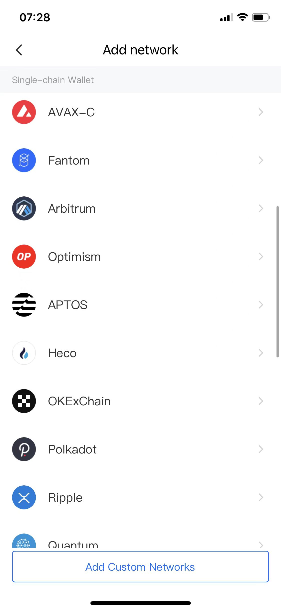
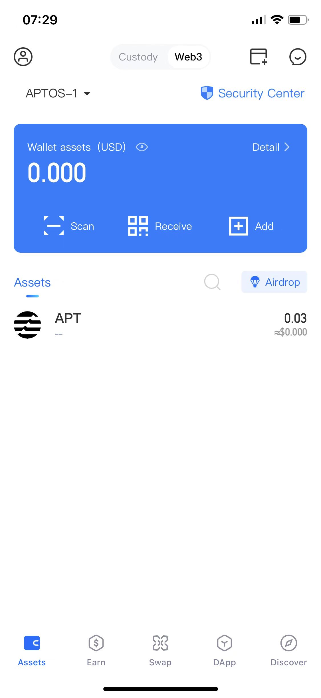
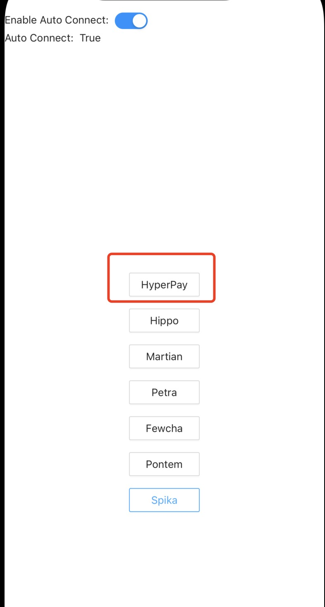

[toc]

# Introduction
This doc will show how to connect the Aptos DApps in HyperPay wallet.

# DApp Development
HyperPay wallet supports Aptos devnet.You can add aptos network in lastest version.



## How To Show HyperPay Wallet
  If DApp wants to show HyperPay wallet info in DAppBrowser. There are several ways to do.
  1. If DApp uses [aptos-wallet-adapter](https://github.com/hippospace/aptos-wallet-adapter) to integrate the wallet, nothing needs to be done. Hyperpay DAppBrowser can directly display relevant wallet information, as shown in the following picture:
  
 aptos-wallet-adapter supports wallets:
  ```js
  {
    Aptos official wallet
    Martian wallet
    Fewcha wallet
    Hippo wallet
    Hippo web wallet
    Pontem Wallet
    Spika wallet
    HyperPay wallet 
    etc...
}
```
  
 2.  If DApp wants to display HyperPay  directly. We can provide wallet logo, etc.   
## How To Connect Wallet 
### Aptos DAppBrowser Methods Supports

#
```swift
enum DAppMethod: String, Decodable, CaseIterable {
    case connect
    case disconnect
    case signMessage
    case signTransaction
    case account
    case signAndSubmitTransaction
    case signTransaction
}
```
## Aptos DApp Connect 
You can also refer to [aptos-core](https://github.com/aptos-labs/aptos-core).
We use the wallet-adapter as the connection method [wallet-adapter](https://github.com/hippospace/aptos-wallet-adapter)
and support npmjs [wallet-adapter](https://www.npmjs.com/package/@manahippo/aptos-wallet-adapter)
If Aptos DApp wants to show HyperPay wallet info in DAppBrowser.
```js
  const wallets = useMemo(
    () => [
      new HyperPayWalletAdapter(),
      new HippoExtensionWalletAdapter(),
      new MartianWalletAdapter(),
      new AptosWalletAdapter(),
      new FewchaWalletAdapter(),
      new PontemWalletAdapter(),
      new SpikaWalletAdapter()
    ],
    []
  );
```
### IsInstalled
```js
const isHyperPayInstalled =  window.hyperPay
```
### connect(request authorization to connect)

```js
await window.hyperpay.connect();
```
Once the mobile application is connected to HyperPay wallet, it will be able to read the connected account's address and publicKey
## account 
```js
const account = await window.hyperpay.account();
console.log(account);
```

# Resources

[website](https://www.hyperpay.tech/)


etc.
