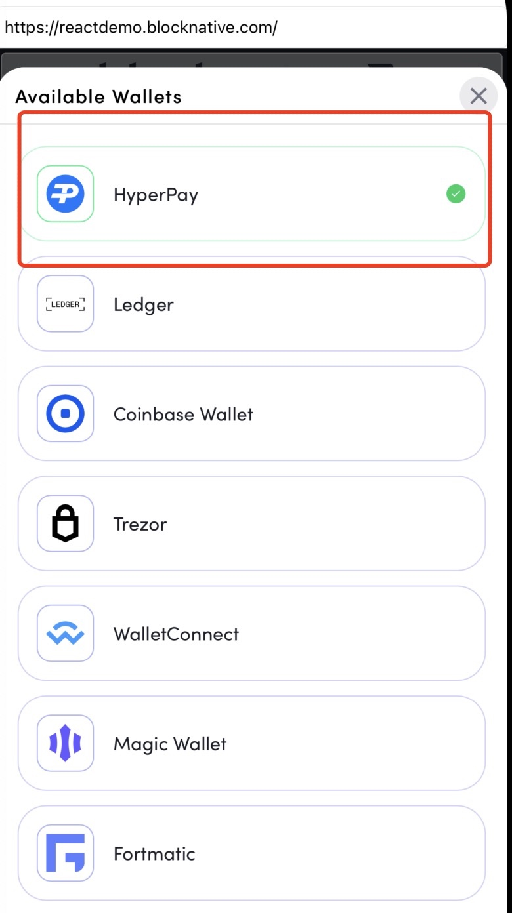

[toc]

# Introduction
This doc will show how to connect the DApps in HyperPay wallet.

# DApp Development
## How To Connect Aptos DApp in HyperPay
[Connect Document](https://github.com/hyperpayorg/connect-dapps/blob/main/HowToConnectAptosDApp.md)
## How To Show HyperPay Wallet
  If DApp wants to show HyperPay wallet info in DAppBrowser. There are several ways to do.
  1. If DApp uses [web3-onboard](https://github.com/blocknative/web3-onboard) to integrate the wallet, nothing needs to be done. Hyperpay DAppBrowser can directly display relevant wallet information, as shown in the following picture:
  
 web3-onboard supports wallets:
  ```js
  export enum ProviderLabel {
  AlphaWallet = 'AlphaWallet',
  AToken = 'AToken',
  Binance = 'Binance Smart Wallet',
  Bitpie = 'Bitpie',
  BlockWallet = 'BlockWallet',
  Brave = 'Brave Wallet',
  Coinbase = 'Coinbase Wallet',
  Dcent = `D'CENT`,
  Detected = 'Detected Wallet',
  Frame = 'Frame',
  HuobiWallet = 'Huobi Wallet',
  HyperPay = 'HyperPay',
  ImToken = 'imToken',
  Liquality = 'Liquality',
  MeetOne = 'MeetOne',
  MetaMask = 'MetaMask',
  MyKey = 'MyKey',
  Opera = 'Opera Wallet',
  OwnBit = 'OwnBit',
  Status = 'Status Wallet',
  Trust = 'Trust Wallet',
  TokenPocket = 'TokenPocket',
  TP = 'TP Wallet',
  WalletIo = 'Wallet.io',
  XDEFI = 'XDEFI Wallet',
  OneInch = '1inch Wallet',
  Tokenary = 'Tokenary Wallet',
  Tally = 'Tally Wallet'
}
```
  
 2.  If EVM DApp wants to display HyperPay  directly. We can provide wallet logo, etc.   
## How To Connect Wallet 
### EVM(Ethereum) Connect
The Metamask protocol is a universal wallet connection scheme for Ethereum or EVM chains. HyperPay complies with the Metamask protocol by default, and will implant window.ethereum object in the webview. Developers can directly develop follow [MetaMask Documents](https://docs.metamask.io/guide/ethereum-provider.html).

```js
(function() {
    var config = {
        address: "\(address.lowercased())",
        chainId: \(chainId),
        rpcUrl: "\(rpcUrl)"
    };

    window.ethereum = new hiWallet.Provider(config);
    window.web3 = new hiWallet.Web3(window.ethereum);
    window.isHyperPay = true;
    
})();
```
### EVM DAppBrowser Methods Supports

#
```swift
enum DAppMethod: String, Decodable, CaseIterable {
    case signTransaction
    case signPersonalMessage
    case signMessage
    case signTypedMessage
    case ecRecover
    case requestAccounts
    case watchAsset
    case addEthereumChain
    case switchEthereumChain
}
```
## Solana DApp Connect 
You can also refer to [solana-web3](https://solana-labs.github.io/solana-web3.js).
We use the official wallet-adapter as the connection method [wallet-adapter](https://github.com/solana-labs/wallet-adapter)
and support npmjs [wallet-adapter-hyperpay](https://www.npmjs.com/package/@solana/wallet-adapter-hyperpay)
If Solana DApp wants to show HyperPay wallet info in DAppBrowser.
```js
 const wallets = useMemo(
    () => [
        new HyperPayWalletAdapter(),
        new PhantomWalletAdapter(),
        new CoinbaseWalletAdapter(),
    ],
);
```
### IsInstalled
```js
const isHyperPayInstalled = window.isHyperPay && window.hyperPay.solana
```
### connect(request authorization to connect)

```js
async connect() {
    if(this.publicKey) {
      this.emit("connect", this.publicKey);
    } else {
      this.publicKey = await  window.hyperPay.solana.getAccount()
      this.emit("connect", this.publicKey);
    }
}
```
## signTransaction 
```js
signTransaction(transaction) { 
    return this._request({
      method: "signTransaction",
      params: {
        transaction:transaction,
        message: transaction.serializeMessage().toString("hex")
      }},true);
  }
```
## signAllTransactions 
```js
 signAllTransactions(transactions) {
    const message = transactions.map(transaction => {
      return transaction.serializeMessage().toString("hex");
    });   
    return this._request({
      method: "signAllTransactions",
      params: {
        transactions:transactions,
        message: message.join(","),
      }},true);
  }

```
### SOLANA DAppBrowser Methods Supports
#
```swift
enum DAppMethod: String, Decodable, CaseIterable {
    case signTransaction
    case signAllTransactions
    case signMessage
    case connect
    case disconnect
    case requestAccounts
    case getAccount
}
```
### solana demo 
[web3.js](https://github.com/solana-labs/solana/tree/master/web3.js)
# Resources

[website](https://www.hyperpay.tech/)


etc.
